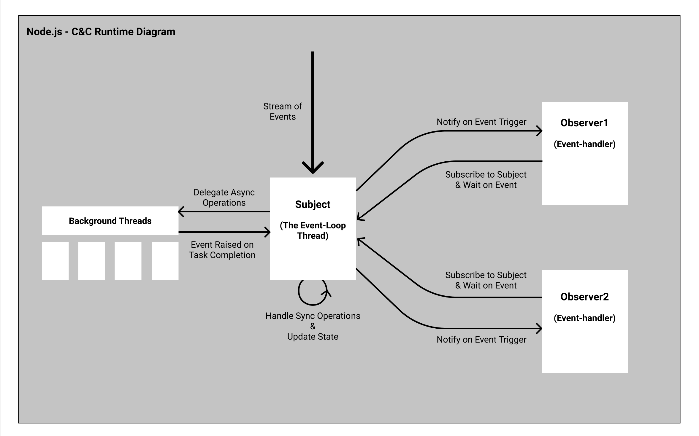

# Milestone 3: Reverse Engineering Architectural Styles
Name: Raphael Bassot
Course: SENG350 - Software Architecture
Group: #2

# Part 2 - Node.js 
### Architectural Style - Node.js' Combined Observer & Event-Driven Software Style
The Node.js runtime environment follows a single-threaded event-loop architecture that handles requests asynchronously, where events dictate the flow of the program. To achieve this type of design, Node.js partially follows an **Observer** software design pattern - a variation of the Pub-Sub design style. This style largely focuses on the ["communication between objects"](https://itnext.io/the-observer-pattern-in-nodejs-c0cfffb4744a), and properly models the reactive nature of Node.js. The Observer design style involves a single *subject* - a core object in the design - and many *observers* - the components that depend on the subject to work properly. In Node's case, the subject can be seen as the main event-loop thread that processes incoming events, and the observers are the event-handlers that wait on these events to notify them when to start working. Additionally, Node.js implements an **Event-driven** style, that more closely resembles an *Event Notification* architectural style, that involves event 'messages' being sent to other components based on a change that occurs during execution (i.e. an event triggered and an event-handler reacts). Node is event-driven, in that it focuses on continuously handling events as they arrive, and uses worker pools (or background threads) to avoid blocking resources with expensive operations. The combination of these styles directly reflects Node's architecture, as Node consists of a main event-loop that is directly associated with the incoming event stream (the subject), and its listener functions or event handlers that trigger when an event completes (the observers).

### Connector & Component (C&C) Diagram
This diagram describes the event-driven execution of the Node.js environment at runtime, which leverages both the Observer and the Event-Notification design patterns. The diagram can also be seen in the attached [PDF](NodeJS-C&C-Diagram.pdf).

**Node.js' Combined Observer & Event-Driven Software Style**

Shows communication between elements various elements, and the dependencies that the observers have towards the subject object. Encapsulates the behaviour of asynchronous event-driven programming, worker pools to delegate expensive operations to, and how event triggers flow through the system.

Elements: Subject and Observers, and other components necessary to the asynchronous runtime environment.

Relations: Attachments and event triggers/notifications.

Constraints: Firm distinction between event-producers and event-handlers; potential tight coupling between event schema and consumers of the schema; who can (and should) observe a specific subject; events move through a deterministic sequence of components.

### About the Architectural Style

I would characterize Node.js as its own architectural style - somewhere between the Observer and the Event-Notification design styles. The Observer pattern is leveraged to describe Node's event-handlers, who wait on the events from the event-loop thread in the same way that observers wait on their subject for a change in state. The distribution of event messages from Node.js' worker pools to the main event-loop thread, and the reaction of the event-handlers upon being notified is best expressed by the Event-Notification pattern. Additionally, this pattern follows that the source of the notification received by the event-handler, which is simply the main thread, is not worried about the response of the event-handler. It only cares that the event was properly received and taken care of from the point of view of the event-loop.

Node.js benefits from using the Observer architectural style because it is so deeply integrated into the way Node's runtime environment functions. In asynchronous execution of Node.js, listeners - that represent observers - continually wait on events before processing, which achieves Node's goal of minimizing resource use through event handling. Once coupled to a subject - such as the event-loop - these listeners can be easily notified by the subject when events are triggered. This style reflects the nature of Node.js' event-driven programming, where events drive the flow of execution and the subject/observers are simply dealing with these events with deterministic behaviour. Additionally, following this style allows for event-based Node.js to be more performant. Node's asynchronous nature means that the worker pools are doing the bulk of the work in the background, meaning the main thread only returns to that task once the background thread notifies that the task is complete. By following this style, Node.js can achieve its goal of being a non-blocking architecture, by tackling asynchronous processing in the background instead of forcing the next request to wait on the availability of the main thread.

Node is constrained by the Observer design pattern. In asynchronous programming, it uses its own `EventEmitter` class to register functions to listen for an event to happen from the subject. By design, Node is constrained by how the subject notifies the observers; increased inter-component dependencies can make modifiability more difficult, and understanding the runtime behaviour more complex. Additionally, the observers and subject must have a connection between them to be able to notify each other, call the right method, or react accordingly to an event. The Event-driven style also constrains Node, in that events must be produced, handled, and consumed by the correct components based on their roles. Therefore, components have a strict relationship between each other, and data (events, here) flows in a predetermined sequence. The number of dependencies from the perspective of the working system also increases; the worker threads must complete tasks, the main thread must properly delegate them, and the event handlers must react correctly to event triggers for the Node.js system to work with quickly and effectively. Following the above constraints allows Node.js to be fast, responsive, and attain the event-driven design they strived for. Adhering to the design styles and abiding by the constraints above, Node.js has become one of the most popular and performant cross-platform JavaScript runtime environments.